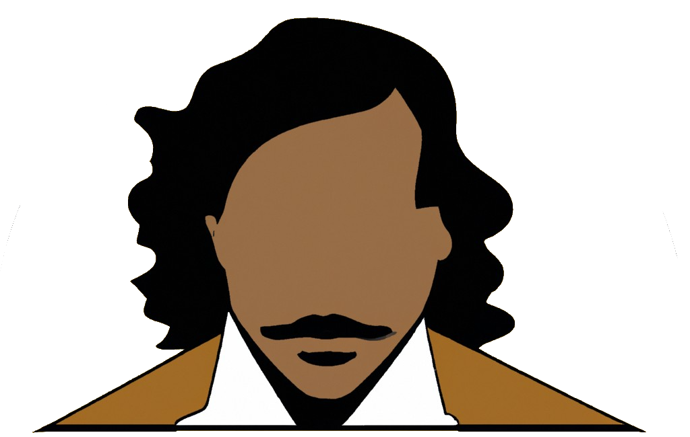

---
tags:
  - "2023"
  - OpenAI
  - Fun projects
---

# novela.ink - AI assistant for creators

[GitHub repository](https://github.com/razikus/novela)

[LabLab.ai link](https://lablab.ai/event/openai-whisper-gpt3-codex-dalle2-hackathon/approxteam/novela-ink)

Youtube video:

  
## OpenAI hackathon

Recently I found out very interesting website https://lablab.ai which is organising and planning a lot of AI hackathons.

It's very good opportunity to check and touch new technologies and im treating it a bit as a sport.

Purpouse of this particular hackathon was to create a soluton that uses existing OpenAI tools like GPT-3 or Dalle.

## Idea

My idea was preety simple - create a software that can help to create books. It has mainly some features:

- Story completion (also in-place between 2 texts, so generates inside missing text)
- Image generation for chapter summary
- Undo / Redo
- Saving, deletion
- Inspirations (AI helps to get something related to your prompt)

## Simplified Architecture

Architecture is pretty simple and preety obvious. Using OpenAI also is very simple.

- Novela - backend worker
- Dalle - AI prompt 2 image provider
- GPT-3 - language model provider (text-davinci-003)
- immudb - as immutable database (has undo redo feature built-in)
- Frontend - frontend :)

## Used technology

- Backend - [FastAPI](https://fastapi.tiangolo.com/) 
- Frontend - [Quasar.js](https://quasar.dev/)  
- Database - [immudb](https://immudb.io/)
- OpenAI API - [OpenAI](https://beta.openai.com/docs/introduction)

Of course dockerized and easy to deploy

## Thoughts

During implementation and making the project I had several predictions for the future and several thoughts that I will try to list here.

- AI will becase normal-day assistant soon.
- Everyone will use more complex AI novadays (not only to make beautiful instagram picture)
- New branch of programming - prompt engineering - choosing a best prompt was the most challenge here to be honest. Combinations, choosing proper sequence of words.
- It's still a big model. (Are we a big models also?)
- Cannot be yet used for decision making - mainly because world is changing every day and currently model is trained up to some point.
- In future software would have assistants built-in.
- It was very easy to implement.

## Prizes and what next

Finaly I've got 3rd place, 250$ Digital Ocean credits, and this cool certificate!

And of course - hands on technology.

What next with that? Some people contacted me, let's see if we can do something.